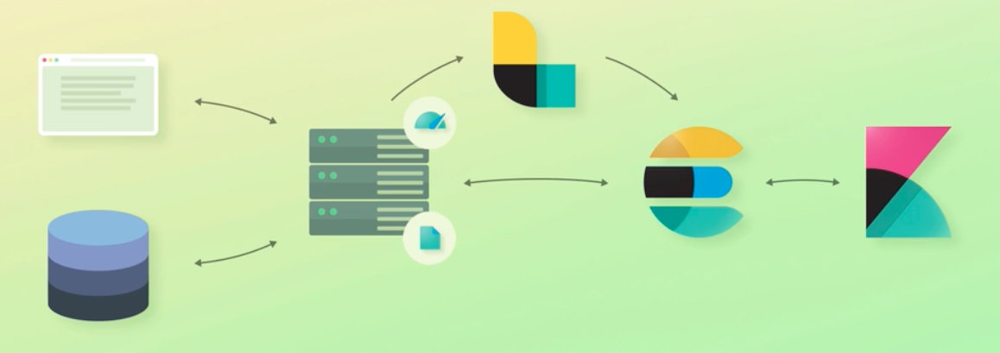

# Elasticsearch Overview

Elasticsearch is an open-source analytics and full-text search engine.

- Used for enabling search functionality in applications.
- Examples include blogs, webshops, etc.

## Search Functionality

- Allows users to search for various types of data (e.g., blog posts, products, categories).
- Capable of complex search features (auto-completion, typo correction, etc.).

## Webshop Example

- Search through product names and full-text fields.
- Consider factors for sorting results (e.g., product ratings).

## Additional Capabilities

- Query structured data (numbers) and aggregate data.
- Use Elasticsearch as an analytics platform for creating charts.

## Application Performance Management (APM)

- Analyze logs, server metrics, etc., and set up alerts.
- Track errors, CPU/memory usage, etc.

## Event Handling

- Send events to Elasticsearch for analysis.
- Example: Analyzing sales data from physical stores.

## Machine Learning Integration

- Forecast sales based on historical data.
- Useful for capacity management.

## Anomaly Detection

- Detect significant deviations from normal behavior.
- Set up alerting for unusual events.

## Document Structure

- Data stored as documents (units of information).
- Documents contain fields (equivalent to columns in a relational database).
- Documents are represented as JSON objects.

## Querying Elasticsearch

- Use REST API to query documents (written in JSON).
- Elasticsearch is built on Java and Apache Lucene.

## Scalability

- Scales well for large data volumes and query throughput.
- Lightning-fast searches, even for millions of documents.

## Popularity and Community

- Used by large companies and has a vibrant community.
- Elasticsearch is a leading name in search engines.

## Kibana
- Analytics and visualization platform.
- Visualize data from Elasticsearch and analyze it.
- Create various visualizations like pie charts, line charts, etc.
- Configure change detection and forecasting.
- Manage parts of Elasticsearch (e.g., authentication).

## Logstash
- Data processing pipeline.
- Processes events and sends them to destinations.
- Consists of inputs, filters, and outputs stages.
- Input plugins (e.g., file, HTTP, database).
- Filter plugins (e.g., parse CSV, XML, JSON).
- Output plugins (e.g., Elasticsearch, Kafka, email).

## X-Pack
### Security
- Adds authentication and authorization to Elasticsearch and Kibana.
- Integrates with LDAP, Active Directory, etc.
- User and role management for specific access levels.

### Monitoring
- Monitor performance of Elastic Stack components.
- Track CPU, memory, disk space, and more.
- Set up alerting for unusual events.

### Reporting
- Export Kibana visualizations and dashboards to PDF.
- Generate reports on demand or schedule them.
- Receive reports via email.

### Machine Learning
- Abnormality detection and forecasting.
- Useful for capacity planning and monitoring.

### Graph
- Analyzes relationships in data.
- Identify relevant connections, not just popular ones.
- Visualize data as interactive graph in Kibana.

### SQL
- Allows querying Elasticsearch with SQL.
- Translates SQL queries into Query DSL.
- Provides Translate API for query translation.

## Beats
- Lightweight agents for data shipping.
- Collect various types of data and send to Logstash or Elasticsearch.
- Filebeat for log files, Metricbeat for system/service metrics.
- Other beats available for different purposes.

## Elastic Stack Components Summary
- Elasticsearch: Central data storage and retrieval.
- Kibana: Visualization and analysis of data.
- Logstash: Data processing and shipping.
- X-Pack: Additional features (security, monitoring, reporting, ML, graph, SQL).
- Beats: Data shippers for collecting and sending data.

## ELK Stack vs Elastic Stack
- ELK Stack: Elasticsearch, Logstash, Kibana.
- Elastic Stack: Elasticsearch, Logstash, Kibana, X-Pack, Beats.

# Common Elasticsearch Architectures

## Simple Integration with Ecommerce Application
- Ecommerce app with data in a database.
- Use Elasticsearch for search functionality.
- Application sends search query to Elasticsearch.
- Application processes response and sends results to browser.
- Data duplication for search functionality.

## Adding Elasticsearch to Existing Application
- Considerations for integrating with existing data.
- Write script for data import or use open source projects.
- Application keeps data updated in Elasticsearch.

## Adding Kibana for Dashboarding
- Use Kibana for business dashboard.
- Run Kibana on a dedicated machine and connect to Elasticsearch.
- Configure Kibana to visualize data from Elasticsearch.

## Adding Metricbeat for System Metrics
- Monitor server performance with Metricbeat.
- Metricbeat sends data to Elasticsearch ingest node.
- Visualize and analyze metrics in Kibana.
- Set up alerts for performance thresholds.

## Adding Filebeat for Log Monitoring
- Monitor access and error logs with Filebeat.
- Filebeat sends logs to Elasticsearch or Logstash for processing.
- Visualize log data in Kibana for analysis.
- Built-in modules for log parsing.

## Centralizing Event Processing with Logstash
- Need for advanced event processing and centralization.
- Send events to Logstash from web servers.
- Logstash processes events and sends to Elasticsearch.
- Keep event processing out of web application.

## Handling Data Updates with Logstash
- Considerations for updating data in Elasticsearch.
- Option to have web app update data directly or through Logstash.
- Ideal goal: Web app queries Elasticsearch, not modifies it.

## Evolving Architecture Over Time
- Example of a simple architecture evolving into a more advanced one.
- Typical use case for Elasticsearch and Elastic Stack.